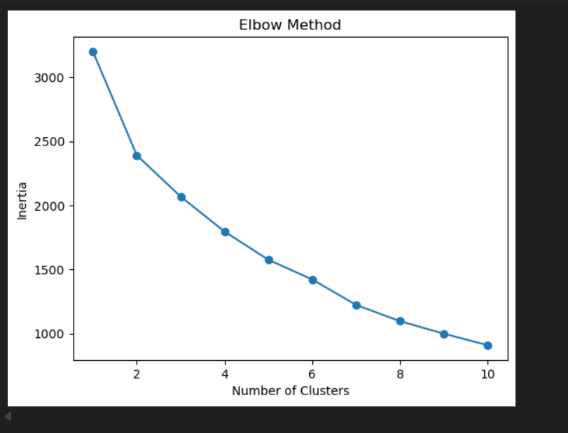
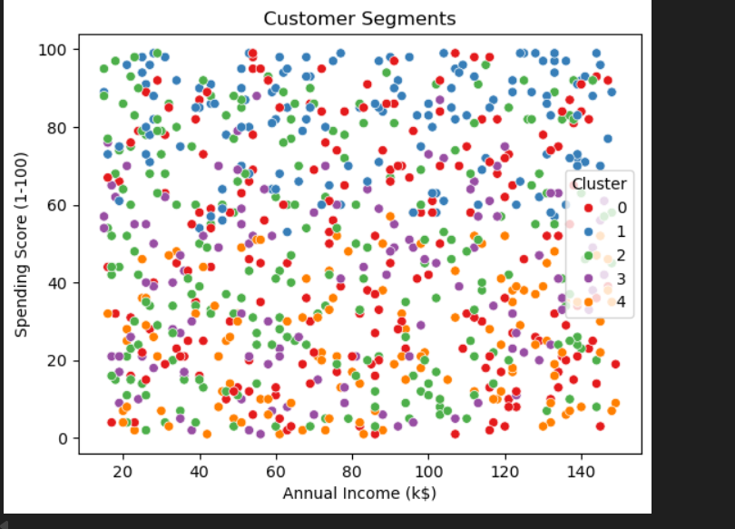

## Results
- Optimal Clusters: 5
- Silhouette Score: 0.3948162750788308
- Clear separation observed between income and spending behavior.
- Feature selection improved clustering performance.

## Visualizations

### Elbow Method

### Customer Segments

## How to Run

1. Clone the repository
2. Install dependencies:
   pip install -r requirements.txt
3. Run the notebook in Jupyter