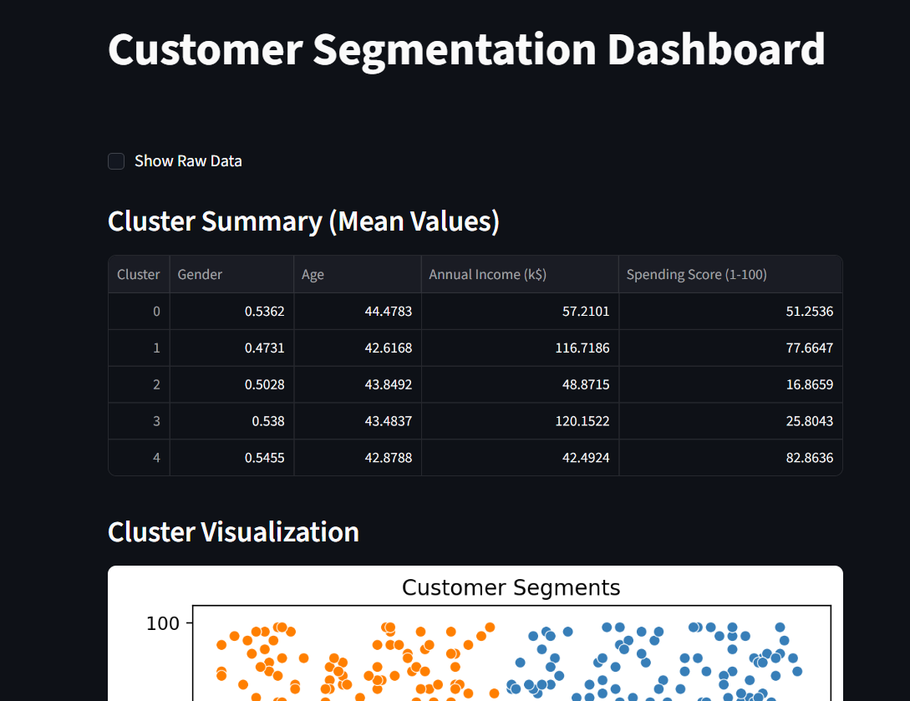

# Customer Segmentation using K-Means Clustering

## Live Demo

🚀 Interactive Dashboard:  
👉 https://customer-segmentation-ml-cbmsbcwtpiuyysjukpzzy5.streamlit.app/

---

## Project Overview

This project performs customer segmentation using **K-Means clustering** to analyze customer income and spending behavior.

The goal is to identify distinct customer groups that can help businesses design targeted marketing strategies and improve customer engagement.

The project includes:
- Data preprocessing
- Feature scaling
- Optimal cluster selection
- Model evaluation
- Interactive dashboard deployment using Streamlit

---

## Key Features

- Data preprocessing and cleaning
- Feature scaling using StandardScaler
- Optimal cluster selection using the Elbow Method
- Cluster evaluation using Silhouette Score
- Interactive Streamlit dashboard for visualization
- Business-level interpretation of customer segments
- Deployed live application

---

## Results

- **Optimal Number of Clusters:** 5  
- **Silhouette Score:** 0.39  
- Clear separation observed between income and spending behavior  
- Feature scaling improved clustering performance  

---

## Streamlit Dashboard

An interactive dashboard was developed using Streamlit to:

- Visualize customer clusters
- Display segment-wise mean analytics
- Show cluster distribution
- Enable interactive data exploration

### Dashboard Preview

---

## Model Visualizations

### Elbow Method

### Customer Segments Visualization

---

## Tech Stack

- Python
- Pandas
- NumPy
- Scikit-learn
- Matplotlib
- Seaborn
- Streamlit

---

## Business Insights

Based on clustering results, customers can be categorized into:

- **Premium Customers:** High income, high spending  
- **Budget Customers:** Low income, low spending  
- **Conservative Customers:** High income, low spending  
- **Impulse Buyers:** Low income, high spending  
- **Average Customers:** Moderate income and spending  

These insights can support:
- Targeted marketing campaigns  
- Personalized promotions  
- Customer retention strategies  
- Revenue optimization  

---

## How to Run Locally

1. Clone the repository:

git clone https://github.com/Deepti0806/customer-segmentation-ml.git

2. Navigate to the project directory:

cd customer-segmentation-ml

3. Install dependencies:

pip install -r requirements.txt

4. Run the Streamlit app:

streamlit run app.py

---

## Future Improvements

- Dynamic cluster selection using sidebar slider  
- Integration with real-time database  
- Additional customer behavioral features  
- Deployment with authentication and analytics tracking  

---

## Author

Deepti Singh  
B.E CSE | Machine Learning & Data Analytics Enthusiast

